# System Architecture

The system is built using Python, FastAPI, and LlamaIndex. It follows a tool-based pipeline architecture that leverages LlamaIndex's query engines and callback systems to provide transparent, explainable query processing.

```mermaid
graph LR
    %% --- Define Styles ---
    classDef data fill:#e6f3ff,stroke:#0066cc,stroke-width:2px;
    classDef process fill:#f2f2f2,stroke:#333,stroke-width:1px;
    classDef database fill:#d4edda,stroke:#155724,stroke-width:2px;
    classDef model fill:#fff3cd,stroke:#856404,stroke-width:3px;
    classDef user fill:#f8d7da,stroke:#721c24,stroke-width:2px;

    %% --- Phase 1: The "ETL" Pipeline for Knowledge ---
    subgraph "Phase 1: Knowledge Ingestion (Offline ETL)"
        direction LR
        
        Docs["Source Documents<br/>(e.g., Wikipedia)"]:::data
        Docs --> |"(1) Chunking"| ChunkProc["Text Processing"]:::process
        ChunkProc --> |"(2) Embed"| EmbeddingModel["Embedding Model"]:::model
        EmbeddingModel --> |"(3) Load"| VectorDB[(Vector Database)]:::database
    end

    %% --- Phase 2: The Live Query Flow ---
    subgraph "Phase 2: Retrieval & Generation (Online Query)"

        UserQuery["User Query"]:::user
        
        subgraph "A. Vectorize the Query"
            UserQuery --> |"Use same model!"| EmbeddingModel2[Embedding Model]:::model
        end
        
        EmbeddingModel2 --> |"Query Vector"| SearchProc
        
        subgraph "B. Retrieve Relevant Context"
            SearchProc{"Similarity Search"}:::process
            VectorDB -.-> SearchProc
            SearchProc --> |"Top-K Results"| Context["Relevant Document Chunks"]:::data
        end
        
        subgraph "C. Augment and Generate"
            PromptBuilder["Prompt Construction"]:::process
            UserQuery --> |"Original Question"| PromptBuilder
            Context --> |"Retrieved Context"| PromptBuilder
            PromptBuilder --> |"Final Prompt:<br/>Context + Question"| LLM["LLM"]:::model
            LLM --> FinalAnswer["Synthesized Answer"]:::user
        end
    end

    %% Link the two identical models to show they are the same asset
    linkStyle 2,3 stroke-width:2px,fill:none,stroke:orange,stroke-dasharray: 5 5;
    EmbeddingModel --- EmbeddingModel2;
```

This architecture provides significant advantages in transparency, modularity, and extensibility while minimizing custom code development.

## Source Code Modules

| Module | File | Responsibility |
|--------|------|---------------|
| **Data Loader** | `src/data_loader.py` | Downloads Wikipedia passages from HuggingFace, converts to LlamaIndex Document objects |
| **Embedding Generator** | `src/embedding_generator.py` | Splits documents into text chunks, generates 3072-dim embeddings via Azure OpenAI |
| **Vector Store** | `src/vector_store.py` | Creates/persists/loads the vector index, performs similarity search, provides query engine for RAG |
| **Model Isolation** | `src/llamaindex_models.py` | Controlled factory for all Azure OpenAI models (GPT-4o, text-embedding-3-large) |
| **Azure Auth** | `src/ailab/utils/azure.py` | Retrieves bearer tokens via DefaultAzureCredential for AI Lab scope |
| **FastAPI App** | `src/main.py` | HTTP endpoints for ingestion, query, RAG generation, chat UI, health checks |

## Key Design Decisions

- **Model isolation**: No code outside `llamaindex_models.py` may instantiate Azure OpenAI models directly
- **Simple pipeline**: Each module does one thing and passes data to the next via plain Python objects
- **Local vector store**: LlamaIndex's built-in `SimpleVectorStore` persists to JSON on disk — no external database required
- **Background ingestion**: Embedding generation runs in a FastAPI background task so the API stays responsive

For a detailed walkthrough of how data flows through the system, see [how_it_works.md](how_it_works.md).